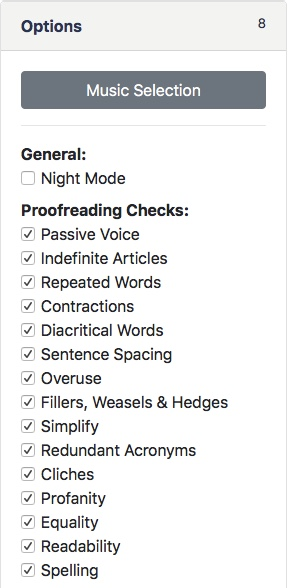

Toggle proofreading modules, the "Night Mode" editor theme,  background music, and more from the "Options" toolbox panel.

#### Night Mode

If you're working late into the night, enable the night mode in order to reduce eye strain.

